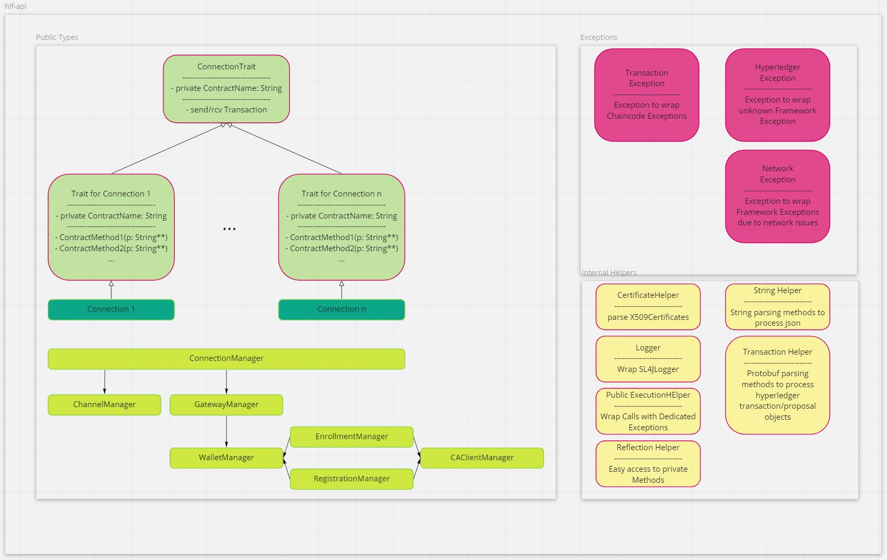

# Architecture

This document describes general design patterns used in the hlf-api.

## ObjectModel

The general architecture of the source code is described in the following diagram.

For each Smart Contract on the chain, there is a Connection (with its respective Trait) that provides access to the defined contract transactions.
This prevents the user from making erroneous calls to the chain.

Each transaction is then wrapped so that possible chain errors are captured and thrown as a TransactionException.
If an error regarding the hyperledger framework is thrown, it is wrapped as a HyperledgerException.
Network issues get wrapped as NetworkExceptions.

## Test Structure

