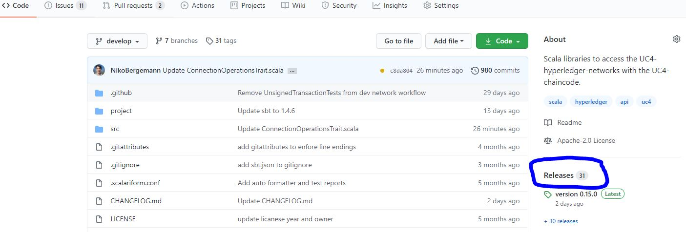
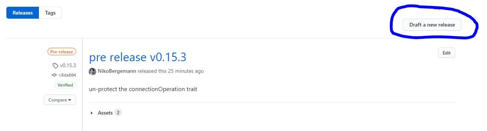
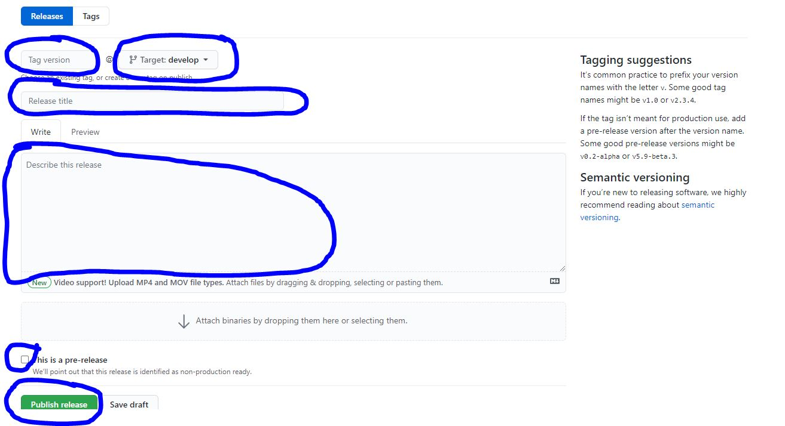
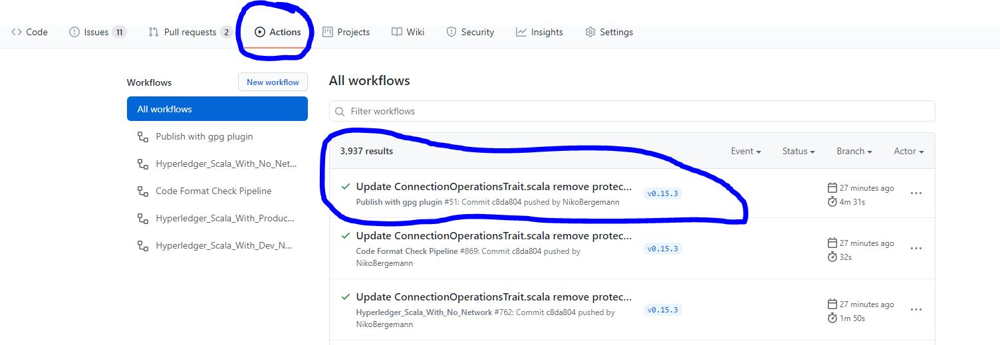

# How to set up a new release

1. Prerequisites
- Make sure everything you want contained in the new release has been meged/pushed to develop.
- Make sure that all Test Pipelines after the merge are run successful to ensure quality.

2. Release Process
- Go to the "releases" page

- Click "Draft new release" Button

- Fill in the necessary Details 
  - version tag: (v0.X.Y)
  - name: (pre)*release (v0.X.Y)
  - Carefully choose whether you want to create a "pre-release"

3. Aftermath
- Check if the Pipeline "PublishWithGpgPlugin" has been successfully executed

